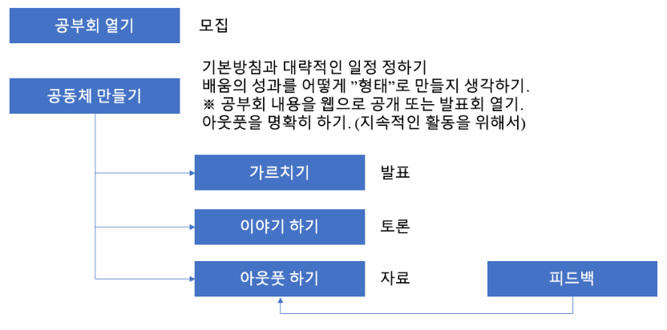

# 가이드라인

공부회를 진행할때 `반드시` 지켜야될 가이드 라인을 명시 합니다.



## 진행 방식에 관해서

1. 총`8명`을 기준으로 공부회를 시작 합니다.
2. 8명에서 각각 2명씩 `4팀`으로 짝을 나눕니다.
3. 각팀은 해당하는 챕터를 담당하며, 사수와 부사수로 나눕니다.
4. 사수가 기본적으로 모든 자료를 만들고 발표를 합니다. 단 사수의 사정으로 인해 부득이하게 참가를 못하게 되었을시에는 부사수가 책임을 지고 발표를 합니다.  
※ 사수는 반드시 시간내에 자료를 만들어서 부사수에게 넘겨 주세요.
5. 사수와 부사수는 격주 단위로 서로 역할이 바뀝니다.(사수 -> 부사수, 부사수 -> 사수)

## 발표 및 자료에 관해서

1. 발표자(사수)는 본인이 해당하는 챕터의 발표 자료를 반드시 당일 공부회가 시작전(예: 20시)까지, 아래의 [폴더](./k8s)에 발표 자료를 넣고 부사수의 레뷰를 받아서 격납할것.
    ```
    [흐름]
    1. [사수] master 브런치에서 feature/xxx 브런치를 만든다.
    2. [사수] feature/xxx에 자료를 올리고 부사수에게 PullRequest를 보낸다.
    3. [부사수] Review를 한뒤, Merge를 한다.
    ```

2. 발표 자료는 `Markdown`형식으로 작성할것.  
※ [샘플](./k8s/sample.md)을 참고.  
※ 이미지는 `screenshots/{챕터 번호}_{이미지 번호(둘째 자리)}`와 같이 저장할것.(예: screenshots/1_01.png)  
3. 발표자는 자신이 누군가를 가르쳐 준다는 생각으로 발표에 임할것.  
※ 이해한걸 표현함으로써 자기것으로 만든다.  
4. 주어진 시간(`10분`)안에 자신의 자료를 정리해서 발표 할것.
5. 항상 `왜?(Why)`를 생각할것.
6. 모르는건 모른다고 할것.(모르는건 부끄러운게 아님)
7. 자료는 누구든지 자유롭게 수정이 가능.

## 참가자에 관해서

1. 발표해(가르쳐)준 사람에게는 감사의 마음을 제대로 전달할것.  
예) 발표 해주셔서 감사드립니다. 000에 관해서 XXX는 어떨때 필요한 가요?
2. 발표자를 위해서 반드시 어드바이스를 할것.
3. 잘못된 정보 전달은 사양말고 지적 할것.  
※ 반드시 `팩트`로 지적 할것.(예: 소스코드, 도큐멘트등)  
4. 지나친 비하 발언 및 욕설은 자제 할것.
5. 상호 존중과 배려를 위해 존칭을 쓸것.  
※ 서로가 친한 친구 또는 직장동료 및 선후배라도 예외 없습니다.  
6. 자신이 방에 입장 또는 다른 참가자가 입장시 반갑게 웃으며 서로 인사 할것.

## 불참에 관해서

1. 당일 공부회에 불참시에는 `#study_k8s` 채널에 불참 의사를 전달 할것.
2. 사수는 부사수에게 불참 의사를 전달하며, 대신 자료 전달 및 부사수를 서포트할것.
3. 부사수 또한 불참 할경우 모임장 `@sangjun`에게 자료를 전달 할것.

## 문의 사항

기타 질문 및 문의 사항에 관해서는 슬랙 `#study_k8s` 채널에서 이야기 해주세요.
